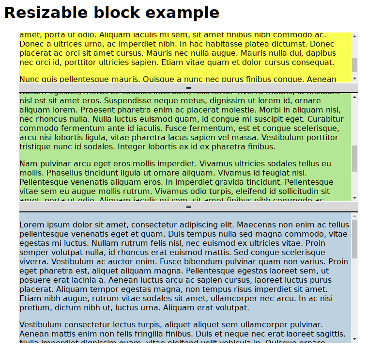

ResizableBlock
==============

ResizableBlock is a small JavaScript library that allows you to create blocks
which can be vertically resized in a block that keeps its height. The blocks
shares the space.

It is meant to be a standalone library (it does not require jQuery or anything
else).

Requirements
------------

This library requires EcmaScript 6 support.

Example
-------

See [sample.html](sample.html)

Usage
-----

In the HTML, just insert `x-resizable` tags containing `div` tags which contains
the actual content:

    <x-resizable data-sizes="0.2,0.2,0.6">
        
<!-- content -->

        
<!-- content -->

        
<!-- content -->

    </x-resizable>

You need to include `resizable-block.css` and `resizable-block.js`.

After these two have been included, just call `ResizableBlock.init()`.

That’s all!
